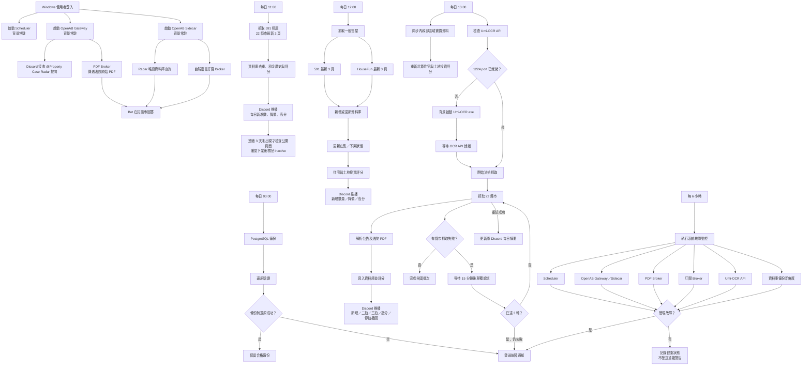

# Property Case Radar 專案任務流程

本文件記錄目前正式環境的每日排程、背景常駐服務、資料處理、失敗重試及 Discord 通知流程。所有時間均為台灣時間（UTC+8）。

## 每日排程

| 時間 | 任務 | 主要內容 |
| --- | --- | --- |
| 03:00 | PostgreSQL 資料庫備份 | 建立每日備份並執行還原驗證；失敗時通知管理頻道 |
| 03:48 | 系統故障監控 | 檢查 Scheduler、OpenAB、Broker、Umi-OCR 與備份狀態 |
| 09:48 | 系統故障監控 | 同上 |
| 11:00 | 租屋案件抓取 | 抓取 591 租屋 22 縣市最新 3 頁，更新資料庫、在租狀態及評分；推播每日新增、降價與高分案件 |
| 12:00 | 一般售屋抓取 | 抓取 591 與 HouseFun 最新 3 頁，更新資料庫、在售狀態及評分；每日新增與高分通知排除基準補建資料 |
| 13:00 | 內政部實價資料同步 | 同步區域實價資料，重新計算住宅與土地投資評分 |
| 13:00 | 法拍案件抓取 | 檢查 Umi-OCR，抓取及解析 22 縣市法拍案件，評分並推播 |
| 15:48 | 系統故障監控 | 同上 |
| 21:48 | 系統故障監控 | 同上 |

系統故障監控目前以 2026-07-28 15:48 為每 6 小時週期的起點，因此每日執行時間為 03:48、09:48、15:48、21:48。若重新登錄 Watchdog Windows 排程，起始分鐘會依重新登錄時間改變。

## 專案任務流程圖

## 背景常駐服務

以下服務沒有每日固定啟動時間，而是在 Windows 使用者登入後啟動並持續於背景執行：

- **Property Case Radar Scheduler**：管理 11:00、12:00 與 13:00 的資料抓取及同步工作。
- **OpenAB Gateway**：接收 Discord 訊息並建立問答流程。
- **OpenAB Sidecar**：執行固定的 Radar 唯讀查詢工具。
- **PDF Broker**：從允許的法拍下載目錄傳送法院原始 PDF。
- **訂閱 Broker**：建立、取消及處理自然語言訂閱。

## 法拍失敗處理

1. 13:00 法拍批次完成後，辨識抓取失敗的縣市。
2. 失敗縣市不會顯示為「0 筆」，而是顯示「抓取失敗／待重試」。
3. 每隔 15 分鐘只重試失敗縣市，最多 3 輪。
4. 重試成功後，更新原本的每日新增、二拍及三拍摘要。
5. 3 輪後仍失敗，立即發送故障通知。

## 執行條件

Windows 排程目前使用互動式登入帳號執行，因此主機必須開機，且指定的 Windows 使用者需保持登入。Scheduler、OpenAB Gateway 與 OpenAB Sidecar 的 Windows 排程均使用隱藏視窗在背景常駐。
